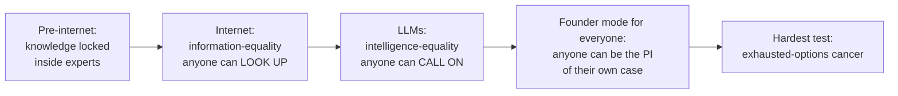
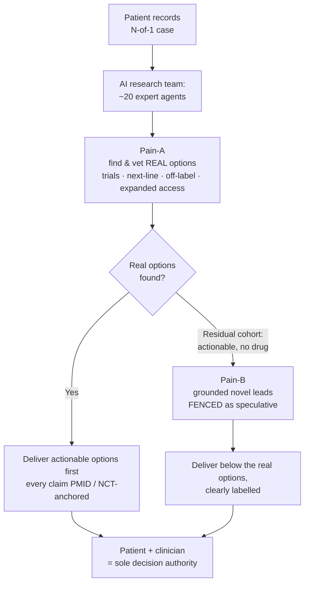

# Founder Mode for Everyone: How Intelligence-Equality Lets Any Cancer Patient Run Their Own Research Team When the Options Run Out

**CancerDAO Contributors**

---

## Abstract

When standard treatment is exhausted, a cancer patient faces two moves: wait for a system that has already returned an empty set, or go *founder mode* — become the principal investigator of your own case and set out to manufacture an option. A few patients did exactly that and reached remission: Sid Sijbrandij, David Fajgenbaum. But each one *bought* the intelligence the move requires — a CEO's budget, a physician's lab. This article argues that founder mode can now be separated from the wealth that used to buy it, and names the engine that separates them. The internet gave ordinary people low-cost *information*: anyone could look up what once only experts knew. Large language models give them something else — low-cost, replicable, callable, scalable *intelligence*: the ability to reason across a stack of records, plan, simulate an expert's thinking, and turn a vague intent into an executable plan. The internet moved us toward information-equality; LLMs move us toward intelligence-equality. **Intelligence-equality is what can put founder mode within reach of a patient who can buy neither budget nor lab** — but only if the research team it stands up does the right job in the right order: first find and vet the real options that already exist (the molecular tumor board's work), then, and only then, generate grounded novel leads, clearly fenced. The literature backs the *method*: models fabricate worst exactly in the rare, recurrent regime where these patients live, and retrieval grounding with checkable citations restores guideline concordance toward ceiling. The literature is thin on the *payoff*: no study yet shows AI closing the resource gap for an ordinary patient, and the precision-oncology benefit the whole enterprise leans on is associative, with one negative randomized trial. A small synthetic benchmark of a concrete build shows that a retrieval-first design improves option selection — while independently surfacing a "know-when-to-stop" overreach. Today's evidence licenses the method, not yet the payoff.

---

## 1. Founder Mode — and the Engine That Democratizes It

There is a word for what Sid Sijbrandij did when the system ran out of options: he went *founder mode*. He stopped waiting for an institution to deliver him a treatment and started building the operation to produce one. It is a powerful move, and until now it has had one fatal property — it was only available to people who could buy a research team. The thesis of this article is simple: a shift now underway is what lets *anyone* go founder mode, not only the resourced few. Name that engine first; then watch it bite on cancer.

Two technologies, two kinds of equality.

The internet drove the marginal cost of *moving information* to near zero. A villager with a phone can now read the same journal abstract, drug label, or guideline summary as a professor. That is information-equality: an ordinary person can **look up** what only experts used to know.

Large language models drive a different cost to near zero — the cost of *applying intelligence to a problem*. An LLM can read a stack of records and summarize it, reason across them, draft a plan, translate jargon into plain language, write the code to analyze a file, and simulate how a specialist would think through a case. That is a different verb. An ordinary person can now **call on** a slice of what only experts used to be able to *do*. That slice is exactly the raw material of founder mode — the research-team thinking that used to cost a budget. Intelligence-equality is what turns founder mode from a rich patient's privilege into a capability anyone can pick up.

| | The internet | Large language models |
|---|---|---|
| **What gets cheap** | Flow of information | Application of high-intelligence |
| **The verb it unlocks** | *Look up* what experts knew | *Call on* what experts could do |
| **For a patient** | Read the abstract, the label, the guideline | Reason across their own records, plan next steps, draft the brief |
| **Core capabilities** | Search, retrieve, share | Understand dense text, summarize, reason & plan, write, code, translate, simulate an expert, turn vague intent into an executable plan |
| **The equality it moves toward** | Information-equality | **Intelligence-equality** |

The interesting question is not whether intelligence-equality is coming. It is *where founder mode bites first*. We argue the sharpest case is the hardest personal problem a person can face: a cancer patient who has run out of standard treatment, where the gap between what an elite research team could do and what the patient can afford is, today, the difference between an option and no option. If intelligence-equality can let *this* patient run their own research team, it can do it anywhere.

## 2. The Exhausted-Options Moment

When Sid Sijbrandij, the chief executive of GitLab, was told that his osteosarcoma had recurred and that no clinical trial fit his case, the institutional machinery had run to its end and returned an empty set. He did not wait for a system to deliver him an option. He built an operation to manufacture one. By his own account he assembled a multidisciplinary team of specialists, commissioned single-cell and bulk RNA sequencing of his tumour alongside personalized immune profiling, travelled internationally to access expertise unavailable at any single site, and kept an N-of-1 database on his own disease. He made himself the principal investigator of his own case, and has reported reaching no evidence of disease.

This is not a lucky anecdote. It instantiates a recognizable archetype, and the cleanest documented precedent is David Fajgenbaum, a physician-scientist dying of idiopathic multicentric Castleman disease with no approved therapy. He profiled his own samples, identified mTOR hyperactivation, repurposed an already-approved drug, sirolimus, reached a durable remission in his own case, and escalated it into a formal clinical trial (Fajgenbaum et al. 2019). What separates this from quackery is its grounding: a novel lead anchored in the patient's own molecular data and in an asset that already existed, vetted and then subjected to formal evidence-generation rather than asserted.

Here is the uncomfortable property both stories share. **Each patient bought the intelligence they needed.** Sijbrandij commanded a chief executive's resources; Fajgenbaum brought a physician's training and a laboratory. Kathy Giusti's patient-founded precision-medicine infrastructure required raising over half a billion dollars (HBS case 814026). These are existence proofs that founder mode *can* work — and proofs that, so far, it has only worked for those who could pay for elite intelligence.

So the question is not whether becoming the PI of your own case helps. It is whether the research-team *intelligence* — not the wealth that bought it — can be made low-cost, replicable, callable, and scalable for a patient who has neither a CEO's budget nor an MD's lab. That is intelligence-equality, applied to the place it matters most.

## 3. Why the Options Run Out — and Why the Manual Fix Doesn't Scale

When a patient exhausts standard-of-care, the problem is rarely that no option exists anywhere on Earth. It is that the options are scattered, gated, and unreachable. Three forces stack up.

**An options desert.** Even inside a fully resourced molecular tumor board (MTB) — the apparatus built to convert molecular data into treatment — only about one in five patients who enter the process receives the recommended therapy (Frost et al. 2022). Roughly 22% have no actionable mutation; about 15% deteriorate before a recommendation can be acted on (they die in the queue); and 31% of studies report an *actionable mutation with no available drug* — the precise boundary where the real-option space has been exhausted (Frost et al. 2022). The headline option beyond standard care, the clinical trial, reaches almost no one: only an estimated 2–8% of adult cancer patients ever enroll (Unger et al. 2019), with the dominant barrier being not ineligibility but the absence of a suitable trial at the patient's own site. Matching only gets harder: lung-cancer trial eligibility criteria grew from a median of 17 to 27 per protocol between the late 1980s and the mid 2010s (Garcia et al. 2017).

**An information asymmetry.** Comprehensive next-generation sequencing — the substrate any precision option depends on — is unevenly distributed; uptake tracks commercial insurance, not clinical need (Nature Cancer 2023). Comprehensive panels surface far more actionable alterations than small ones (81% vs 21%; JCO Precision Oncology 2017), so patients who are never broadly sequenced are quietly foreclosed from options that, for them, will never appear to exist.

**An agency vacuum.** A patient at this juncture wants to decide but has no team to decide with and no map of the terrain. The default routes them through a single oncologist who is, in practice, the gatekeeper to one institution's menu — and an MTB recommendation, even when produced, is implemented in fewer than a third of cases (PMC7962829). The patient-empowerment lineage predates AI — the "e-patient" framework was authored by a physician who himself died of multiple myeloma (Ferguson 2007), and patient-led networks have produced real evidence, as when a self-organized cohort correctly refuted the hyped lithium-in-ALS result (Wicks et al. 2011) — but every instance was bottlenecked by human labour.

That bottleneck is exactly what Sijbrandij overcame by brute force, and exactly why his fix does not scale. The MTB is not a building; it is a *role-set* — medical oncologist, molecular pathologist, bioinformatician, geneticist, convened case-by-case, now extended by European consensus to a dozen-plus contributors including pharmacologists, radiation oncologists, bioethicists, and patient representatives (CAN.HEAL Consortium 2025). That accumulated specialist labour is the thing only money has bought. Intelligence-equality, if it is real, compresses that labour — not the resources.

## 4. The Patient's AI Research Team — and the Two Jobs It Must Do in Order

The wager is that a coordinated set of expert AI agents can reproduce the MTB's role-set and compress its labour, putting research-team intelligence within a patient's reach. Whether that compression actually reaches a non-elite patient is unproven — we return to it. First, the part the proposal cannot survive without: the team must do the right job, in the right order.

The patient's need splits into two tasks.

| | **Pain-A — find the real options** | **Pain-B — generate novel leads** |
|---|---|---|
| **What it is** | Retrieve, match, and vet options that already exist | Generate grounded *new* hypotheses |
| **Examples** | Next-line regimens, NGS-matched & off-label drugs with compendium support, open trials, expanded-access pathways | N-of-1 hypotheses, drug repurposing, "world-unknown" candidates |
| **Whose job** | The molecular tumor board's actual job | The frontier research lab's job |
| **When it runs** | **First, and exhaustively** | **Only on the residual Pain-A can't satisfy** |
| **Status** | Tractable & verifiable today | Preclinical even at its best |
| **How it's labelled** | Established / actionable | Fenced as exploratory / speculative |

The ordering is the whole ballgame, for three reasons.

**Maturity.** Pain-A is doable and checkable now: trial-matching at near-expert accuracy with sentence-anchored explanations is already demonstrated (Jin et al. 2024), and off-label legitimacy is defined by evidence-graded compendium support, not improvisation (Conti et al. 2013). Pain-B remains preclinical even in its strongest cases — the multi-agent systems that produced genuinely novel hypotheses validated them only in vitro or in organoids (Gottweis et al. 2026; Robin 2026), and one such system's authors state plainly it does not replace a research team (Gottweis et al. 2026). Offering a "world-unknown" candidate before exhausting the catalogue of established options substitutes the speculative for the available — the exact inversion that turns hope into therapy tourism for unproven interventions, whose documented harms are severe (PMC8890798).

**The boundary is empirical.** The "actionable mutation, no available drug" residual — about 31% of studies (Frost et al. 2022) — *is* the Pain-A → Pain-B hand-off. A patient earns the right to speculate only once the real-option space is demonstrably empty.

**It matters most where these patients live.** The N-of-1 literature is evidentially sloppy by default — only 3.48% of studies meet all reporting standards (Batley et al. 2023) — so AI's job is to add rigor, not ambition: pool and vet anecdote into signal rather than amplify it (cf. Gouda et al. 2023). Find the real options first, anchor every claim to a checkable source, keep the patient as sole decision authority. That is the line between a democratized research team and false hope.

## 5. Building It Without Manufacturing Evidence

The hard architectural question is not whether a language model *can* discuss exhausted-options oncology, but whether it can be constrained to do so without inventing the very evidence a desperate patient cannot independently check. OPL — the build this article describes — is one concrete instantiation: a multi-wave AI research team of roughly twenty expert roles, each backed by live data integrators (PubMed, ClinicalTrials.gov, ChiCTR, OncoKB, CIViC), with every patient-facing claim anchored to a retrievable identifier (a PMID, an NCT or ChiCTR registration, a compendium entry) and tagged *established*, *exploratory*, or *speculative*, so the Pain-A/Pain-B fence is visible inside the brief itself.

Restraint here is non-negotiable, because the naive approach fails worst exactly where these patients live. Citation fabrication is topic-dependent — roughly 6% for well-covered conditions but 28–29% for rarer ones (JMIR 2025) — and raw GPT-4 NCCN concordance falls to 73.8% on *recurrent* cancers (Tsai et al. 2024), Sijbrandij's precise regime. A patient handing over OCR-corrupted records is an adversarial prompt: every tested model elaborated a planted fake clinical detail 50–83% of the time, and a mitigation prompt only halved it, leaving roughly 23% residual (Omar et al. 2025). Prompt hygiene alone is not enough. The constructive answer in the literature is grounding plus checkable attribution: agentic and graph-RAG architectures have reached roughly 92–100% NCCN concordance *with* document-and-page citations (arXiv 2502.15698, preprint). That ceiling was reached by *other* systems, not OPL — OPL's own NCCN number in our benchmark is the overreach reported in §6, not this ceiling. But it is why OPL is built retrieval-first with PMID anchoring rather than trusting model self-consistency, and why a retraction-screening layer is required, since LLMs silently cite retracted oncology papers in roughly 10% of cases (Gu et al. 2025).

Three design commitments follow. An **Evidence Contract**: integrators run *live, never from memory* — when a source is unreachable the system emits a fallback block rather than substituting the model's recollection. **Gating the delivered brief**: the gates inspect the document the patient actually receives, not a parallel side-file it could drift away from. **Actionable-first ordering**: real options that already exist — trials, next-line regimens, expanded-access pathways — are rendered *above* speculative candidates, so Pain-A is literally presented before Pain-B. These are design intentions, not a validated fix; whether they hold up is what §6 tests.

This inverts the emphasis of the AI co-scientist systems that motivate the Pain-B ambition. Google's AI co-scientist (Gottweis et al. 2026) ranks novel hypotheses through an idea tournament; FutureHouse's Robin (2026) ran a full hypothesis-to-experiment loop to surface a repurposing candidate (ripasudil for dry AMD) humans had not. Both validate only in vitro and in organoids, and the co-scientist's authors are explicit it does not replace a research team. Where those systems optimize Pain-B novelty, OPL front-loads Pain-A retrieval-and-vetting — the tractable, patient-relevant job demonstrated near expert level (Jin et al. 2024) — and fences Pain-B as clearly-labelled speculation downstream.

The residual limits stand. Mitigation prompts reduce but never eliminate hallucination (~23% residual; Omar et al. 2025); over-tight grounding can omit valid guideline-concordant options (PMC12017742); any matcher is capped by registry quality, acutely so for ChiCTR (PMC10602811). No published architecture resolves the loose-versus-tight tension in oncology at once. OPL's choice — retrieve broadly, vet strictly, never silently drop, keep the patient deciding — is a defensible position within that tension, not an escape from it.

## 6. What the Benchmark Shows

We evaluated whether a retrieval-first design measurably improves a patient-facing brief using **synthetic cases and a prompt-driven adapter — not the production engine**. The adapter does not run OPL's full stack: no hypothesis tournament, no downstream evidence-and-validation passes, none of the deterministic Python gates; the multi-agent arms were reduced to synchronous calls, and the verifier is an LLM stand-in for a live registry. All five arms share one reasoning model (MiniMax-M2.7) at identical temperature and retry budget, so the only contrast is the prompt corpus and multi-agent shape. Cases are synthetic, n=30 per arm per surface, across two surfaces: colorectal-cancer (CRC) therapy selection and NCCN decision concordance. Confidence intervals are wide; we treat metric deltas below roughly 0.1 as noise.

The five arms:

| Arm | What it is |
|---|---|
| **baseline** | Single model call, no scaffold |
| **MTB-anchor** | MTB-style retrieval prompt, single pass |
| **MTB-full** | MTB-style multi-expert pipeline |
| **OPL-anchor** | OPL retrieval-first prompt, single pass |
| **OPL-full** | OPL multi-expert pipeline |

**CRC therapy selection — the retrieval-first design wins.**

| Arm | Therapy F1@3 (full denom) | nDCG@3 |
|---|---|---|
| baseline | 0.394 | 0.497 |
| MTB-anchor | 0.416 | **0.580** |
| MTB-full | 0.391 | — |
| **OPL-anchor** | **0.507** | 0.569 |
| OPL-full | 0.304 | — |

OPL-anchor leads on finding the right real options: its F1@3 margin over baseline is **+0.113**, which clears the ~0.1 noise band — a real signal. Ranking (nDCG@3) is mixed: MTB-anchor edges it (0.580 vs 0.569). All arms score low in absolute terms, so this is a relative ordering on a hard synthetic surface, not evidence of clinical adequacy. Note too that the retrieval-first arm makes *more* recommendations, which helps it find real options and sets up the counter-finding below.

**NCCN decision concordance — every multi-expert pipeline overreaches.** This surface rewards *stopping* to ask for a missing discriminator. The correct move is often "I need more information," and that is where the pipelines fail.

| Arm | Strict concordance (higher better) | Unsafe-overreach (lower better) |
|---|---|---|
| **baseline** | **0.565** | **0.000** |
| MTB-anchor | 0.278 | 0.273 |
| OPL-anchor | 0.235 | 0.222 |
| MTB-full | 0.211 | 0.533 |
| OPL-full | 0.105 | 0.733 |

Baseline wins decisively, and overreach climbs with pipeline complexity — OPL-full fans out into specific recommendations on 0.733 of cases where it should have stopped. The honest reading is symmetric and it is the heart of the evidence: **the retrieval-first design wins at finding the right real options (CRC), but every multi-expert pipeline overreaches on the surface that demands knowing when to stop (NCCN).** The method helps you find options. The open hard problem is teaching the AI restraint — when to ask rather than answer.

Two caveats bound all of this. First, the adapter is **prompt-driven**: it tests the prompt design, not the production engine's safeguards (live-integrator wiring; gates that inspect the delivered brief; rendering real options above speculative ones) — the exact mechanisms aimed at overreach. Whether those resolve it requires a separate end-to-end validation we have not run. Second, the small n and synthetic substrate keep intervals wide. The field also offers an external cautionary anchor we treat fully in §7: the first randomized precision-oncology trial, SHIVA01, was negative, its failure attributed to weak matching rules (Le Tourneau et al. 2015) — itself the find-the-real-options argument.

## 7. Discussion

The evidence licenses the *method* far more readily than the *payoff*.

The case for the method is strong. Models fabricate references most exactly in the rare, under-studied regime where these patients live — ~6% for well-covered conditions versus 28–29% for rarer ones (JMIR 2025) — and raw model concordance degrades on precisely the recurrent disease that defines Sijbrandij's situation (Tsai et al. 2024). Against this, retrieval-grounded, attribution-bearing architectures push concordance toward ceiling (~92–100% under document-and-page citation; arXiv 2502.15698, preprint) — though, as §5 notes, demonstrated by systems other than OPL. Exhaust the real options first, fence the speculative leads, anchor every claim to a traceable source: this is well supported as engineering and as epistemics.

The *intelligence-equality payoff* is the thinnest part of the evidence, and it is the central open question, not a settled result. No published study shows an AI system closing the resource gap for an ordinary patient. Every documented founder-mode success still required elite inputs — Fajgenbaum's MD training and lab (Fajgenbaum et al. 2019), Giusti's half-billion-dollar infrastructure (HBS case 814026), Sijbrandij's CEO-level resourcing. That AI compresses the *labour* of a dozen-plus-role tumor board (CAN.HEAL Consortium 2025) is plausible; that the compression delivers real options to a non-elite patient is, at present, an untested hypothesis.

Two further limits bound any benefit claim. First, the precision-oncology benefit the enterprise leans on is associative, not causal: supportive cohorts are single-arm and selection-confounded, and the first randomized trial, SHIVA01, was negative (PFS 2.3 vs 2.0 months; Le Tourneau et al. 2015). Its failure was attributed to weak matching — which is itself the find-the-real-options argument — but that argument cannot be both the explanation for a negative trial and proof of benefit, and we do not treat it as the latter. Second, the trust boundary ultimately rests on the host model honestly transcribing the evidence it retrieves. Mitigation halves adversarial hallucination but leaves ~23% residual (Omar et al. 2025); models silently cite retracted oncology work in ~10% of cases (Gu et al. 2025); over-tight grounding omits valid options (PMC12017742). No architecture solves both failure modes at once in oncology. Our own evidence is correspondingly modest: a small-n, synthetic, prompt-driven adapter — not the production engine — that supports a narrow find-the-real-options ranking signal while independently surfacing overreach that persists at the prompt level (OPL-full NCCN unsafe-overreach 0.733), with the engine-layer safeguards still unvalidated. A final bias: the founder-mode existence proofs are selected survivors; we cannot estimate how many comparably-resourced patients pursued this path and did not benefit.

These limits define the ethics. The system democratizes hypothesis generation and option-vetting, not bedside decisions: research support, not treatment advice, with the patient and their clinician as the sole decision authority. Even the AI co-scientist's authors state it does not replace a research team or conduct science alone (Gottweis et al. 2026). Access and radical transparency follow as design principles: finding real options maps to lawful but invisible pathways — FDA Expanded Access proceeds in ~99% of requests once manufacturer consent and cost clear (Mayo Clin Proc Innov Qual Outcomes 2020), regional pathways such as Hainan Boao Lecheng have reportedly served more than 28,000 patients (Frontiers in Medicine 2025), and off-label use is legitimate precisely when compendium-graded (Conti et al. 2013) — so the value is surfacing and drafting, never forcing coverage or consent. Echoing Sijbrandij's own openness about his N-of-1 effort, every claim must trace to a verifiable record: you cannot trust a match you cannot trace.

## 8. Conclusion: From Privilege to Capability

Founder mode is the move; intelligence-equality is the engine that democratizes it. The internet let an ordinary person look up what only experts knew. LLMs let an ordinary person call on a slice of what only experts could do — and that slice is the research-team thinking founder mode runs on. The hardest place to test the promise is an exhausted-options cancer — and there, the patients who escaped did so by *buying* the elite intelligence that everyone else now needs handed to them for free. The contribution we argue AI can make is narrower and more honest than the marketing temptation: not to manufacture the desperation that drove these patients, but to make the rigor that made their search legitimate — rather than dangerous — low-cost, replicable, callable, and scalable.

That rigor is the load-bearing claim. Find the real options first and exhaustively: next-line therapy, NGS-matched drugs, trials, expanded access, evidence-graded off-label use. This is tractable today at near-expert level when grounded and attributable (Jin et al. 2024), and grounding with checkable citation is what pushes guideline concordance toward ceiling in other systems rather than leaving the patient a fluent but fabricated answer. Only then, on the "actionable-but-no-drug" residual that even fully resourced boards leave stranded (Frost et al. 2022), fence novel-lead generation — an idea tournament rather than raw output (Gottweis et al. 2026), held to the rigor that distinguishes a published N-of-1 from an anecdote (Batley et al. 2023). Anchor every claim to a live, traceable source; keep the patient and clinician deciding. This sequence is what separates a democratized research team from quackery — the alternative, novel leads without finding-and-vetting first, is the failure mode that degrades into stem-cell tourism (PMC8890798).

Our own evidence licenses the method, not the payoff, and saying so is itself the rigor this article argues for. The benchmark shows a retrieval-first design improves real-option ranking (OPL-anchor CRC therapy F1@3 +0.113 over baseline, above noise), but independently surfaces overreach — pushing past "need more information" — that the multi-expert pipelines do not yet escape (OPL-full NCCN unsafe-overreach 0.733). The field carries at least one negative randomized trial (Le Tourneau et al. 2015) whose failure traces to weak matching, the very gap finding-the-real-options addresses.

Three things remain to be shown. First, the central open question: a prospective demonstration that an *ordinary*, non-elite-resourced patient gains real options through such a system — intelligence-equality is, as yet, an untested hypothesis, since every documented success still needed elite resources. Second, a single validated pipeline integrating find-the-real-options and grounded novel-lead generation, which no published architecture yet does. Third, the residual safety frontier — teaching the AI when to stop: mitigation reduces but never eliminates fabrication (Omar et al. 2025), models still cite retracted work silently (Gu et al. 2025), and over-tight grounding omits valid options (PMC12017742). Until these are closed, the honest position is that today's evidence licenses the method, not yet the payoff. Moving a patient's research team from a privilege of the resourced few toward an accessible capability is worth pursuing precisely because, and only as long as, it is pursued with that candor.

---

## References

1. Batley NJ, et al. Evidence and reporting standards in N-of-1 medical studies: a systematic review. *Translational Psychiatry*. 2023;13:263. DOI: 10.1038/s41398-023-02562-8.

2. CAN.HEAL Consortium. A decalogue of recommendations for molecular tumor boards. *European Journal of Cancer*. 2025. DOI: 10.1016/j.ejca.2025.02.014 (S0959-8049(25)00214-X).

3. Conti RM, et al. Prevalence of off-label use and spending in 2010 among patent-protected chemotherapies in a population-based cohort of medical oncologists. *Journal of Clinical Oncology*. 2013;31(9):1134–1139. PMCID: PMC3595423.

4. Fajgenbaum DC, et al. Identifying and targeting pathogenic PI3K/AKT/mTOR signaling in IL-6-blockade-refractory idiopathic multicentric Castleman disease. *Journal of Clinical Investigation*. 2019;129(10):4451–4463. DOI: 10.1172/JCI126091.

5. Ferguson T, e-Patient Scholars Working Group. *e-Patients: How They Can Help Us Heal Health Care*. Society for Participatory Medicine; 2007.

6. Frost N, et al. Patient attrition in molecular tumour boards: a systematic review. *British Journal of Cancer*. 2022;127(8):1557–1564. DOI: 10.1038/s41416-022-01922-3.

7. Garcia S, et al. Clinical trial eligibility criteria over time in lung cancer (ECOG analysis). *Journal of Thoracic Oncology*. 2017. PMCID: PMC5610621.

8. Gottweis J, Natarajan V, et al. Towards an AI co-scientist. *Nature*. 2026. DOI: 10.1038/s41586-026-10644-y.

9. Gouda MA, et al. N-of-1 trials in cancer drug development. *Cancer Discovery*. 2023;13(6):1301–1309. DOI: 10.1158/2159-8290.CD-22-1377.

10. Gu Z, et al. Citation of retracted oncology articles by large language models. *Journal of Advanced Research*. 2025. DOI: 10.1016/j.jare.2025.03.020. PMCID: PMC12126723.

11. Harvard Business School. Kathy Giusti and the Multiple Myeloma Research Foundation. HBS Case No. 814026.

12. Jin Q, et al. Matching patients to clinical trials with large language models (TrialGPT). *Nature Communications*. 2024;15:9074. DOI: 10.1038/s41467-024-53081-z.

13. Le Tourneau C, et al. Molecularly targeted therapy based on tumour molecular profiling versus conventional therapy for advanced cancer (SHIVA): a multicentre, open-label, proof-of-concept, randomised, controlled phase 2 trial. *Lancet Oncology*. 2015;16(13):1324–1334. (Crossover analysis: *Annals of Oncology*. 2017.)

14. Omar M, et al. Large language models are highly vulnerable to adversarial hallucination attacks during clinical decision support. *Communications Medicine*. 2025;5:330. DOI: 10.1038/s43856-025-01021-3.

15. Robin (FutureHouse). Autonomous multi-agent discovery of a therapeutic candidate (ripasudil for dry AMD). *Nature*. 2026. DOI: 10.1038/s41586-026-10652-y; arXiv:2505.13400.

16. Tsai C-H, et al. Concordance of large language model recommendations with NCCN guidelines for cancer treatment, including recurrent disease. *Digital Health*. 2024;10. DOI: 10.1177/20552076241269538. PMCID: PMC11325467.

17. Unger JM, et al. Patient enrollment in cancer clinical trials: barriers and participation rates. *Journal of the National Cancer Institute* / ASCO Educational Book. 2019. PMID: 31099636.

18. Wicks P, et al. Accelerated clinical discovery using self-reported patient data collected online and a patient-matching algorithm. *Nature Biotechnology*. 2011;29(5):411–414. DOI: 10.1038/nbt.1837.

19. Retrieval-augmented and agentic-RAG LLM concordance with NCCN guidelines (preprint). arXiv:2502.15698.

20. Topic-dependent citation fabrication in clinical large language models. *Journal of Medical Internet Research (JMIR)*. 2025. PMCID: PMC12658395.

21. Contextualized LLM oncology recommendations and the omission of guideline-concordant options (NSCLC). PMCID: PMC12017742.

22. ChiCTR registry data-quality analysis. *Frontiers in Medicine*. 2023. PMCID: PMC10602811.

23. Inequities in precision-oncology diagnostics and NGS uptake. *Nature Cancer*. 2023. DOI: 10.1038/s43018-023-00568-1.

24. Comprehensive versus limited NGS panels and actionable-alteration yield. *JCO Precision Oncology*. 2017.

25. The molecular tumor board as a clinical tool for converting molecular data into real-world patient care. *JCO Precision Oncology*. 2023. DOI: 10.1200/PO.23.00067.

26. Transitioning the molecular tumor board from proof of concept to clinical routine. 2021. PMCID: PMC7962829.

27. Expanded access versus right to try. *Mayo Clinic Proceedings: Innovations, Quality & Outcomes*. 2020. PMCID: PMC7081483.

28. Boao Lecheng pilot zone and access to overseas-approved drugs in China. *Frontiers in Medicine*. 2025. PMCID: PMC12588950.

29. International stem cell tourism: a critical literature review. 2021. PMCID: PMC8890798.
