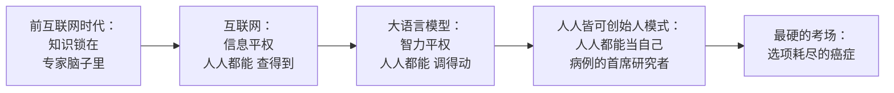
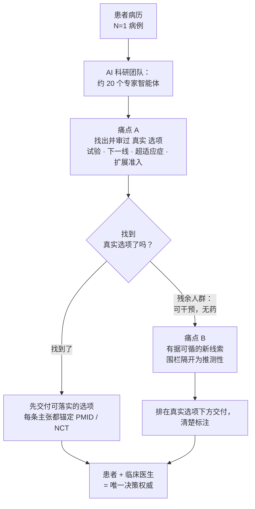
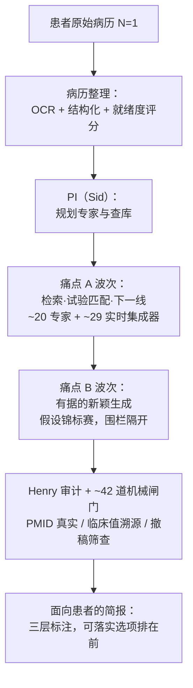

# 人人皆可创始人模式：智力平权如何让每一个癌症患者在无路可走时，跑起自己的科研团队

**CancerDAO Contributors**

---

## 摘要

当标准治疗用尽，一个癌症患者面前只剩两步棋：要么等一个早已返回空集的系统，要么进入*创始人模式*（founder mode）——成为自己病例的首席研究者，亲自去**造**出一个选项。极少数患者真就这么做了，并且抵达了缓解：Sid Sijbrandij、David Fajgenbaum。但他们每一个人，都是把这一步所需的智力**买**了下来——一位 CEO 的预算，一位医生的实验室。本文要论证的是：创始人模式如今可以与从前用来购买它的财富相剥离，并点名那台完成剥离的引擎。互联网给了普通人低成本的*信息*：任何人都能查到从前只有专家才懂的东西。大语言模型给的是另一样东西——低成本、可复制、调得动、可规模化的*智力*：在一摞病历之上推理、规划、模拟专家如何思考、把一个模糊的意图变成可执行计划的能力。互联网把我们推向信息平权（information-equality）；大语言模型把我们推向智力平权（intelligence-equality）。**正是智力平权，才有可能把创始人模式送到一个既买不起预算、也买不起实验室的患者手边**——但前提是，它撑起来的那支科研团队，要以正确的顺序做正确的事：先把已经存在的真实选项找全、审过（下一线方案、在招试验、扩展准入、NGS 匹配药），然后，且只有在这之后，才生成有据可循的新线索，并清清楚楚地围栏隔开。文献支持这套*方法*：模型恰恰在这些患者所处的罕见、复发场景里编造得最凶，而带可核查引文的检索接地，能把指南一致性重新拉回接近天花板。文献对*回报*则单薄：尚无任何研究表明 AI 为一个普通患者抹平了资源鸿沟，而整桩事业所倚仗的精准肿瘤学获益是相关性的，还附带一项阴性随机试验。我们已经把这套系统建了出来；但还没有对生产引擎做过端到端的严格评估——那是最紧要的下一步。今天的证据，许可了方法，还没许可回报。

---

## 1. 创始人模式及其平民化引擎

Sid Sijbrandij 在系统耗尽选项时做的那件事，是有一个词的：他进入了*创始人模式*（founder mode）。他不再等一家机构把治疗送上门，而是着手搭起一套能产出治疗的运作。这是一步很强的棋，而直到现在，它都带着一个致命属性——它只对买得起一支科研团队的人开放。本文的论点很简单：眼下正在发生的一场转变，让*任何人*都能进入创始人模式，而不只是有资源的少数人。先把那台引擎点出来；再看它如何咬住癌症。

两种技术，两种平权。

互联网把*搬运信息*的边际成本压到近乎为零。一个拿着手机的村民，如今能读到和一位教授一样的期刊摘要、药品说明书或指南纲要。这就是信息平权：一个普通人能**查得到**从前只有专家才懂的东西。

大语言模型把另一种成本压到近乎为零——*把智力施加到一个问题上*的成本。一个 LLM 能读完一摞病历并把它总结、在它们之间交叉推理、起草一份计划、把术语翻成大白话、写出分析某个文件的代码、模拟一位专科医生会如何想透一个病例。这是一个不同的动词。一个普通人如今能**调得动**从前只有专家才*做得到*的那一小片本事。而那一小片，恰恰是创始人模式的原料——那种从前要花一笔预算才能买到的科研团队式思考。正是智力平权，把创始人模式从一个有钱患者的特权，变成了任何人都能拾起的一种能力。

| | 互联网 | 大语言模型 |
|---|---|---|
| **什么变便宜了** | 信息的流动 | 高强度智力的施加 |
| **它解锁的动词** | *查得到*专家所知 | *调得动*专家所能 |
| **对患者而言** | 读摘要、读说明书、读指南 | 在自己的病历上交叉推理、规划下一步、起草研究简报 |
| **核心能力** | 检索、调取、分享 | 读懂密集文本、总结、推理与规划、写作、写代码、翻译、模拟专家、把模糊意图变成可执行计划 |
| **它趋向的平权** | 信息平权 | **智力平权** |

有意思的问题，不是智力平权来不来。而是*创始人模式先在哪里咬下去*。我们主张，最锋利的那个场景，是一个人能面对的最难的私人问题：一个标准治疗已经用尽的癌症患者——在这里，一支精英科研团队能做到的，与这个患者负担得起的，二者之间的差距，今天就等于"有选项"与"没选项"之差。如果智力平权能让*这样*一个患者跑起自己的科研团队，那它在任何地方都能做到。

## 2. 标准治疗耗尽的临界时刻

当 GitLab 首席执行官 Sid Sijbrandij 被告知他的骨肉瘤复发、且没有任何临床试验适合他的病例时，机构那套机器已经跑到尽头，返回了一个空集。他没有等一个系统把选项送上门。他搭起了一套运作去**造**一个出来。据他自述，他召集了一支多学科专家团队，对自己的肿瘤做了单细胞与 bulk RNA 测序，外加个体化免疫谱分析，跨国奔波以获取任何单一机构都拿不到的专长，并为自己的疾病维护了一个 N=1 数据库。他把自己变成了自己病例的首席研究者，并报告说抵达了无疾病证据状态。

这不是一桩走运的轶事。它实例化了一个可辨认的原型，而文献记录最干净的先例是 David Fajgenbaum——一位身患特发性多中心型 Castleman 病、无获批疗法、命悬一线的医师科学家。他为自己的样本做了谱分析，识别出 mTOR 过度激活，把一款早已获批的药物西罗莫司老药新用，在自己身上抵达持久缓解，并把它升格成一项正式的临床试验（Fajgenbaum et al. 2019）。把这与江湖骗术区分开的，是它的接地：一条扎根于患者自身分子数据、扎根于一项早已存在的资产之上的新线索，先审过，再交付正式的证据生成，而不是空口断言。

这两个故事共有一个让人不舒服的属性。**每一个患者，都把自己所需的智力买了下来。**Sijbrandij 调得动一位首席执行官的资源；Fajgenbaum 带来了一位医生的训练和一间实验室。Kathy Giusti 那套由患者创立的精准医疗基础设施，要靠筹集超过五亿美元才建得起来（HBS case 814026）。这些是创始人模式*行得通*的存在性证明——也是迄今为止它只对那些付得起精英智力的人行得通的证明。

所以问题不在于"成为自己病例的首席研究者"有没有用。问题在于：那份科研团队的*智力*——不是买下它的财富——能不能被做成低成本、可复制、调得动、可规模化的东西，交给一个既没有 CEO 预算、也没有医学博士实验室的患者。这就是智力平权，被施加到它最要紧的地方。

## 3. 选项耗尽的成因与手工解法的不可规模化

当一个患者把标准治疗用尽，问题极少是"地球上任何地方都不存在选项"。问题在于，选项是散落的、设了门槛的、够不着的。三股力量叠在一起。

**一片选项荒漠。**哪怕在一套资源完备的、专为把分子数据转成治疗而造的标准精准肿瘤学流程里，进入流程的患者里也只有约五分之一最终拿到了推荐的疗法（Frost et al. 2022）。大约 22% 没有可干预的突变；约 15% 在推荐能被落实之前就恶化了（他们死在了排队里）；而 31% 的研究报告了*有可干预突变却无可用药物*——这恰恰是真实选项空间被耗尽的那条边界（Frost et al. 2022）。标准治疗之外那个最响亮的选项——临床试验——几乎触及不到任何人：据估计只有 2–8% 的成年癌症患者曾经入组（Unger et al. 2019），而主导性的障碍并不是不符合资格，而是患者所在的院区根本没有合适的试验。匹配只会越来越难：肺癌试验的入组资格标准，从 1980 年代末到 2010 年代中期，每份方案的中位数从 17 条涨到了 27 条（Garcia et al. 2017）。

**一道信息不对称。**全面的二代测序——任何精准选项所依赖的底料——分布极不均衡；它的采用率跟的是商业保险，而不是临床需求（Nature Cancer 2023）。全面 panel 比小 panel 浮现出的可干预改变要多得多（81% 对 21%；JCO Precision Oncology 2017），于是那些从未被广泛测序过的患者，就悄无声息地被挡在了那些选项之外——对他们而言，那些选项将永远不会显得存在过。

**一段能动性真空。**走到这一步的患者，想自己做决定，却没有团队可以一起决定，也没有一张地形图。默认路径把他们送进单一一位肿瘤科医生那里——而那位医生在实践中，就是通往一家机构那份菜单的守门人——而这样一份推荐，即便产出了，被真正落实的也不到三分之一的病例（PMC7962829）。患者赋权的谱系早于 AI——"e-患者"框架的作者，本人就是一位死于多发性骨髓瘤的医生（Ferguson 2007），而患者自发组织的网络也产出过真实的证据，比如一个自组织队列曾正确地推翻了被炒得火热的"锂治疗 ALS"结果（Wicks et al. 2011）——但每一个实例，都卡在人力这个瓶颈上。

那个瓶颈，正是 Sijbrandij 用蛮力越过去的东西，也正是他那套解法无法规模化的原因。那套把分子数据转成治疗的标准流程，不是一栋楼；它是一套*角色集*——肿瘤内科医生、分子病理学家、生物信息学家、遗传学家，按病例逐个召集，如今经欧洲共识扩展到了十几位以上的贡献者，包括药理学家、放射肿瘤学家、生物伦理学家和患者代表（CAN.HEAL Consortium 2025）。那笔累积起来的专家劳动，正是只有钱才买得到的东西。智力平权，如果它是真的，压缩的是那笔劳动——而不是资源。

## 4. 患者的 AI 科研团队：须按序完成的两项任务

这一注押的是：一组协同的专家 AI 智能体把科研团队的智力送到患者手边。那种压缩是否真能触及一个非精英患者，尚未被证明——我们后面会回到这一点。先说提案离了它就活不下去的那部分：这支团队必须以正确的顺序，做正确的活。

患者的需求拆成两件活。

| | **痛点 A——找出真实的选项** | **痛点 B——生成新线索** |
|---|---|---|
| **是什么** | 检索、匹配并审过已经存在的选项 | 生成有据可循的*新*假设 |
| **例子** | 下一线方案、NGS 匹配及有 compendium 支持的超适应症用药、在招试验、扩展准入通道 | N=1 假设、老药新用、"世界未知"候选 |
| **是谁的活** | 临床团队为患者找选项的活 | 前沿研究实验室的活 |
| **何时运行** | **先做，且穷尽** | **只在痛点 A 满足不了的残余上做** |
| **当下状态** | 今天就可处理、可核验 | 即便最好也仍停在临床前 |
| **如何标注** | 已确立 / 可干预 | 围栏隔开为探索性 / 推测性 |

这个顺序就是全部胜负所在，有三个原因。

**成熟度。**痛点 A 今天就可做、可核：以接近专家的准确度做试验匹配、并附带句级锚定的解释，已经被演示过（Jin et al. 2024），而超适应症用药的正当性，是由证据分级的 compendium 支持来界定的，不是即兴发挥（Conti et al. 2013）。痛点 B 即便在它最强的案例里也仍停在临床前——那些产出了真正新颖假设的多智能体系统，只在体外或类器官里验证过它们（Gottweis et al. 2026；Robin 2026），而其中一套系统的作者直白地声明，它并不取代一支科研团队（Gottweis et al. 2026）。在穷尽已确立选项的目录之前就抛出一个"世界未知"候选，是用推测性的去替换可得的——这正是那种把希望变成"未经证实干预的疗法旅游"的反转，而后者已被记录的危害极其严重（PMC8890798）。

**这条边界是经验性的。**那个"有可干预突变、却无可用药物"的残余——约占 31% 的研究（Frost et al. 2022）——*就是*痛点 A → 痛点 B 的交接点。一个患者只有在真实选项空间被证明确实为空之后，才挣得了推测的权利。

**它在这些患者所处之地最要紧。**N=1 文献默认在证据上就很潦草——只有 3.48% 的研究满足全部报告标准（Batley et al. 2023）——所以 AI 的活是增加求实，而不是增加野心：把轶事汇集、审过、提炼成信号，而不是去放大它（参 Gouda et al. 2023）。先找出真实的选项，把每条主张锚定到一个可核查的来源，让患者始终是唯一决策权威。这就是一支平民化的科研团队与虚假希望之间的那条线。

## 5. 在不制造证据的前提下构建系统

那个困难的架构问题，不是一个语言模型*能不能*谈论"选项耗尽"的肿瘤学，而是它能不能被约束到——在谈论时不去发明那个绝望患者无法独立核查的证据本身。OPL——本文所描述的这套构建——是一个具体的实例化：一支多波次的 AI 科研团队，约二十个专家角色，每一个都由实时数据集成器（PubMed、ClinicalTrials.gov、ChiCTR、OncoKB、CIViC）支撑，每一条面向患者的主张都锚定到一个可检索的标识符（一个 PMID、一个 NCT 或 ChiCTR 注册号、一条 compendium 条目），并被打上*已确立*、*探索性*或*推测性*的标签，于是痛点 A／痛点 B 的那道围栏，在简报内部就看得见。

### OPL 的技术骨架

把上面那句话拆开，OPL 由四层构成：

- **一、5 波（5-Wave）生命周期。** 患者把原始病历交进来，系统先做病历整理（OCR + 结构化 + 就绪度评分）；再由首席研究者（PI，代号 Sid）规划该让哪些专家上场、查哪些库；随后 Wave 1–5 依次并迭代地展开——检索、专家并行分析、假设生成与锦标赛、计算复核、整合渲染；每一步都过一遍审计员 Henry，最后交付一份面向患者的简报。
- **二、一支约 20 人的虚拟实验室。** 1 个 PI + 约 20 个专家角色 + 1 个审计员。痛点 A 这边有"试验匹配专家""下一线／标准治疗专家"等角色；痛点 B 这边有负责"世界未知"候选生成的角色。专家不是一个笼统的"AI 助手"，而是各有职责、各自带库。
- **三、约 29 个实时数据集成器，按家族编组。** 文献（PubMed / PaperQA / OpenTargets）、指南（NCCN）、试验（ClinicalTrials.gov / ChiCTR / ISRCTN / 欧盟 CTR）、变异可干预性（OncoKB / CIViC / ClinVar / gnomAD）、扩展准入（FDA / NMPA / EMA）、药物规范化（RxNorm）……专家**实时去这些库里取证，而不是凭记忆作答**。
- **四、约 42 道机械闸门（G1–G37+）。** 不是让另一个 LLM 来"判卷"，而是确定性的代码检查、机械地以非零退出码拦截：被引的 PMID 必须真实存在、且主题与该主张相关；简报里每一个临床数值必须能锚回原始病历的某一行；撤稿论文要被筛掉；标成"已确立"的主张必须真有指南／III 期证据撑着；服务必须真跑完该跑的专家（不许偷工减料）。

配合三层标注（已确立／探索性／推测性）和那份"实时取证、绝不凭记忆、够不着就抛错"的证据契约，这套骨架的意图只有一句话：**让一份漂亮的简报，没法在没有真实证据支撑时蒙混过关。**

这里的克制是不容商量的，因为朴素的做法恰恰在这些患者所处之地失败得最惨。引文编造是依主题而变的——覆盖充分的疾病约 6%，但更罕见的疾病高达 28–29%（JMIR 2025）——而原始 GPT-4 在*复发*癌症上的 NCCN 一致性跌到 73.8%（Tsai et al. 2024），正是 Sijbrandij 所处的那个精确场景。一个递交 OCR 损坏病历的患者，本身就是一条对抗性提示词：每一个受测模型都把一处植入的虚假临床细节添油加醋地展开了 50–83% 的次数，而一条缓解性提示词也只把它砍掉一半，留下约 23% 的残余（Omar et al. 2025）。光靠提示词卫生是不够的。文献里那个建设性的答案是接地加上可核查的归因：智能体式与图谱 RAG 架构，在*带*文档与页码引文的情况下，已经达到约 92–100% 的 NCCN 一致性（arXiv 2502.15698, preprint）。那个天花板是*别的*系统达到的，不是 OPL——OPL 自己还没有在生产引擎上做过端到端评测（见 §6），所以这个天花板是别人的成绩，不是 OPL 已经达到的。但这正是为什么 OPL 被建成检索优先、用 PMID 锚定，而不是去信任模型的自洽性，也是为什么需要一层撤稿筛查，因为 LLM 在约 10% 的情况下会不声不响地引用被撤稿的肿瘤学论文（Gu et al. 2025）。

由此引出三条设计承诺。一份**证据契约**：集成器*实时运行，绝不凭记忆*——当一个来源够不着时，系统抛出一个兜底区块，而不是用模型的回忆去顶替。**对交付简报设闸**：那些闸门检查的是患者实际收到的那份文档，而不是一个它可能漂移开去的并行旁档。**可落实选项优先排序**：那些已经存在的真实选项——试验、下一线方案、扩展准入通道——被渲染在推测性候选*之上*，于是痛点 A 字面意义上就排在痛点 B 之前。这些是设计意图，不是一个已验证的解法；它们到底立不立得住，正是 §6 要测的。

这把那些驱动了痛点 B 雄心的 AI 协同科学家系统的重心，倒了过来。谷歌的 AI co-scientist（Gottweis et al. 2026）通过一场想法锦标赛给新假设排名；FutureHouse 的 Robin（2026）跑了一整圈从假设到实验的闭环，浮现出一个人类没找到的老药新用候选（ripasudil 用于干性 AMD）。两者都只在体外和类器官里验证，而 co-scientist 的作者明确表示它不取代一支科研团队。在那些系统优化痛点 B 的新颖性之处，OPL 把痛点 A 的检索与审核前置——这是那件可处理、与患者相关、已被演示到接近专家水平的活（Jin et al. 2024）——并把痛点 B 作为清楚标注的推测，围栏在下游。

那些残余的限制仍然站着。缓解性提示词能减少但永远消不掉幻觉（约 23% 残余；Omar et al. 2025）；接地过紧会漏掉有效的、符合指南的选项（PMC12017742）；任何匹配器都受制于注册库的质量，对 ChiCTR 尤其如此（PMC10602811）。没有任何已发表的架构能在肿瘤学里同时解开"松与紧"这对张力。OPL 的选择——广检索、严审核、绝不悄悄丢弃、让患者始终在做决定——是那对张力之内一个站得住脚的立场，而不是从它里面的一次逃脱。

## 6. 评估：已建成，尚待严格验证

诚实地说，我们还没有对生产引擎做过一次严格的端到端评估。因此这一节不给出"OPL 有效"的硬证据，只说清两件事：已经建成了什么，以及接下来必须测什么。

迄今为止跑过的，只是一个**提示词驱动的代理评估**——用合成病例，把各条提示词喂给同一个推理模型作比较。但这个代理**并不运行真正的生产引擎**：它不接实时集成器、不跑那些确定性的机械闸门、也不做"可落实选项排在推测之前"的渲染。也就是说，它衡量的只是提示词设计，而 OPL 真正用来防编造、防越界的那套保险（§5 的四层骨架），一道都没被它执行到。**一个测不到真引擎的代理，不能拿来当这套系统奏效的证据；因此本文不报告它的数字。**

真正该做、却尚未做的评估是这样的：把真实患者病历送进完整的 5-Wave 引擎，实时联网取证、机械闸门全开，然后度量几件可证伪的事——

- **选项召回**：它找回的真实选项（下一线、在招试验、扩展准入），相对一个金标准临床团队所找到的，覆盖了多少？
- **引用准确率**：每一条被锚定的 PMID / NCT 是否真实存在、且主题相关？编造率是否为零？
- **知道何时该停**：在判别因子缺失、正确动作本应是"再要更多信息"的病例上，它是停下来追问，还是越界给出具体推荐？

这才是能够支撑或推翻"这套系统真能帮到患者"的评估。在它跑出结果之前，本文的立场是克制的：**我们论证了方法的合理性——它直接回应了文献中记录在案的失败模式——但还没有拿出方法奏效的回报证据。** 这套设计，是被文献里的失败模式驱动的，而不是被我们自己某个未经验证的基准驱动的。

## 7. 讨论

证据许可*方法*，远比许可*回报*来得爽快。

支持方法的理由是强的。模型恰恰在这些患者所处的罕见、被研究不足的场景里编造参考文献最凶——覆盖充分的疾病约 6%，更罕见的高达 28–29%（JMIR 2025）——而原始模型的一致性，恰恰在那个定义了 Sijbrandij 处境的复发疾病上退化（Tsai et al. 2024）。与此相对，检索接地、带归因的架构把一致性推向天花板（在文档与页码引文下约 92–100%；arXiv 2502.15698, preprint）——尽管如 §5 所述，这是由 OPL 之外的系统演示的。先穷尽真实选项，把推测性线索围栏隔开，把每条主张锚定到一个可追溯的来源：这套作为工程、作为认识论，都得到了很好的支持。

那个*智力平权的回报*，是证据里最单薄的部分，而它是核心的开放问题，不是一个已定的结论。没有任何已发表的研究表明，一套 AI 系统为一个普通患者抹平了资源鸿沟。每一个被记录的创始人模式成功案例，都仍然需要精英级的投入——Fajgenbaum 的医学博士训练和实验室（Fajgenbaum et al. 2019）、Giusti 那套五亿美元的基础设施（HBS case 814026）、Sijbrandij 那种 CEO 级别的资源调配。"AI 压缩了一个十几角色以上的临床团队的*劳动*"（CAN.HEAL Consortium 2025）是说得通的；但"那种压缩把真实选项交到了一个非精英患者手上"，目前是一个未经检验的假设。

还有两条限制，限定了任何获益主张。第一，整桩事业所倚仗的精准肿瘤学获益是相关性的，不是因果性的：那些支持性的队列都是单臂的、受选择混杂的，而第一项随机试验 SHIVA01 是阴性的（PFS 2.3 对 2.0 个月；Le Tourneau et al. 2015）。它的失败被归因于匹配太弱——这本身就是"找出真实选项"的论证——但那个论证不能既是一项阴性试验的解释、又是获益的证明，我们不把它当作后者。第二，那条信任边界，最终落在宿主模型是否诚实地转录它检索到的证据上。缓解把对抗性幻觉砍掉一半，却留下约 23% 残余（Omar et al. 2025）；模型在约 10% 的情况下不声不响地引用被撤稿的肿瘤学工作（Gu et al. 2025）；接地过紧会漏掉有效选项（PMC12017742）。没有任何架构能在肿瘤学里一次解开这两种失败模式。我们自己也还没拿出对生产引擎的端到端证据：那套防编造、防越界的保险虽已建成，却尚未被严格评测过（见 §6）。还有最后一重偏倚：那些创始人模式的存在性证明，是被筛选出来的幸存者；我们无法估计，有多少资源相当的患者走了这条路、却没有获益。

这些限制界定了伦理。这套系统平民化的是假设生成和选项审核，不是床旁决策：是研究支持，不是治疗建议，患者和他们的临床医生是唯一决策权威。哪怕是 AI co-scientist 的作者也声明它不取代一支科研团队、也不独自做科学（Gottweis et al. 2026）。可及性与彻底的透明，作为设计原则随之而来：找出真实选项，对应的是那些合法却隐形的通道——FDA 扩展准入在厂商同意且费用厘清之后，约 99% 的申请得以推进（Mayo Clin Proc Innov Qual Outcomes 2020），像海南博鳌乐城这样的区域性通道据报道已服务超过 28,000 名患者（Frontiers in Medicine 2025），而超适应症用药恰恰在有 compendium 分级时才是正当的（Conti et al. 2013）——所以价值在于浮现与起草，绝不在于强行获得报销或同意。呼应 Sijbrandij 本人对自己 N=1 努力的开放态度，每一条主张都必须追溯到一份可核验的记录：你不能信任一个你追溯不了的匹配。

## 8. 结语：从特权到能力

创始人模式是那一步棋；智力平权是让它平民化的那台引擎。互联网让一个普通人查得到从前只有专家才懂的东西。大语言模型让一个普通人调得动从前只有专家才做得到的那一小片本事——而那一小片，正是创始人模式赖以运转的科研团队式思考。考验这个承诺最硬的地方，是一个选项耗尽的癌症——而在那里，逃出生天的患者，靠的是**买**下别人如今需要被免费递到手上的那份精英智力。我们主张 AI 能做的贡献，比营销的诱惑要更窄、也更诚实：不是去制造那种驱动了这些患者的绝望，而是把那份让他们的搜寻变得正当——而非危险——的求实，做成低成本、可复制、调得动、可规模化的东西。

那份求实，是承重的那条主张。先找出真实的选项，且穷尽：下一线疗法、NGS 匹配的药物、试验、扩展准入、证据分级的超适应症用药。这在今天、在接地且可归因时，已可处理到接近专家水平（Jin et al. 2024），而带可核查引文的接地，正是把指南一致性在别的系统里推向天花板、而不是给患者留下一个流畅却编造的答案的东西。只有到那时，在那个连资源完备的委员会也搁置在那里的"可干预却无药"残余之上（Frost et al. 2022），才围栏隔开新线索的生成——一场想法锦标赛，而不是原始输出（Gottweis et al. 2026），并守住那份把一个已发表的 N=1 与一桩轶事区分开来的求实（Batley et al. 2023）。把每条主张锚定到一个实时、可追溯的来源；让患者和临床医生始终在做决定。正是这个顺序，把一支平民化的科研团队与江湖骗术分开——它的反面，即没有先找出并审核就上新线索，正是那种退化成干细胞旅游的失败模式（PMC8890798）。

我们自己的证据许可了方法，不是回报，而把这话说出来，本身就是本文所主张的那份求实。我们还没有对生产引擎跑出端到端的奏效证据；那项严格评估，是紧接着要做的事（见 §6）。这一领域至少背着一项阴性随机试验（Le Tourneau et al. 2015），其失败可追溯到匹配太弱——而那正是"找出真实选项"所应对的缺口。

还有三件事有待证明。第一，那个核心的开放问题：一次前瞻性的演示，证明一个*普通的*、没有精英资源的患者，确实通过这样一套系统获得了真实选项——智力平权至今仍是一个未经检验的假设，因为每一个被记录的成功都仍然需要精英资源。第二，一条单一的、已验证的管线，把"找出真实选项"和"有据可循的新线索生成"整合在一起，而这是任何已发表架构都还没做到的。第三，那条残余的安全前沿——教会 AI 何时该停：缓解能减少却永远消不掉编造（Omar et al. 2025），模型仍在不声不响地引用被撤稿的工作（Gu et al. 2025），而接地过紧会漏掉有效选项（PMC12017742）。在这些被闭合之前，诚实的立场是：今天的证据许可了方法，还没许可回报。把一个患者的科研团队，从有资源的少数人的一项特权，挪向一项可及的能力——这件事值得去追求，恰恰因为、且仅当，它是带着那份坦诚去追求的。

---

## References

1. Batley NJ, et al. Evidence and reporting standards in N-of-1 medical studies: a systematic review. *Translational Psychiatry*. 2023;13:263. DOI: 10.1038/s41398-023-02562-8.

2. CAN.HEAL Consortium. A decalogue of recommendations for molecular tumor boards. *European Journal of Cancer*. 2025. DOI: 10.1016/j.ejca.2025.02.014 (S0959-8049(25)00214-X).

3. Conti RM, et al. Prevalence of off-label use and spending in 2010 among patent-protected chemotherapies in a population-based cohort of medical oncologists. *Journal of Clinical Oncology*. 2013;31(9):1134–1139. PMCID: PMC3595423.

4. Fajgenbaum DC, et al. Identifying and targeting pathogenic PI3K/AKT/mTOR signaling in IL-6-blockade-refractory idiopathic multicentric Castleman disease. *Journal of Clinical Investigation*. 2019;129(10):4451–4463. DOI: 10.1172/JCI126091.

5. Ferguson T, e-Patient Scholars Working Group. *e-Patients: How They Can Help Us Heal Health Care*. Society for Participatory Medicine; 2007.

6. Frost N, et al. Patient attrition in molecular tumour boards: a systematic review. *British Journal of Cancer*. 2022;127(8):1557–1564. DOI: 10.1038/s41416-022-01922-3.

7. Garcia S, et al. Clinical trial eligibility criteria over time in lung cancer (ECOG analysis). *Journal of Thoracic Oncology*. 2017. PMCID: PMC5610621.

8. Gottweis J, Natarajan V, et al. Towards an AI co-scientist. *Nature*. 2026. DOI: 10.1038/s41586-026-10644-y.

9. Gouda MA, et al. N-of-1 trials in cancer drug development. *Cancer Discovery*. 2023;13(6):1301–1309. DOI: 10.1158/2159-8290.CD-22-1377.

10. Gu Z, et al. Citation of retracted oncology articles by large language models. *Journal of Advanced Research*. 2025. DOI: 10.1016/j.jare.2025.03.020. PMCID: PMC12126723.

11. Harvard Business School. Kathy Giusti and the Multiple Myeloma Research Foundation. HBS Case No. 814026.

12. Jin Q, et al. Matching patients to clinical trials with large language models (TrialGPT). *Nature Communications*. 2024;15:9074. DOI: 10.1038/s41467-024-53081-z.

13. Le Tourneau C, et al. Molecularly targeted therapy based on tumour molecular profiling versus conventional therapy for advanced cancer (SHIVA): a multicentre, open-label, proof-of-concept, randomised, controlled phase 2 trial. *Lancet Oncology*. 2015;16(13):1324–1334. (Crossover analysis: *Annals of Oncology*. 2017.)

14. Omar M, et al. Large language models are highly vulnerable to adversarial hallucination attacks during clinical decision support. *Communications Medicine*. 2025;5:330. DOI: 10.1038/s43856-025-01021-3.

15. Robin (FutureHouse). Autonomous multi-agent discovery of a therapeutic candidate (ripasudil for dry AMD). *Nature*. 2026. DOI: 10.1038/s41586-026-10652-y; arXiv:2505.13400.

16. Tsai C-H, et al. Concordance of large language model recommendations with NCCN guidelines for cancer treatment, including recurrent disease. *Digital Health*. 2024;10. DOI: 10.1177/20552076241269538. PMCID: PMC11325467.

17. Unger JM, et al. Patient enrollment in cancer clinical trials: barriers and participation rates. *Journal of the National Cancer Institute* / ASCO Educational Book. 2019. PMID: 31099636.

18. Wicks P, et al. Accelerated clinical discovery using self-reported patient data collected online and a patient-matching algorithm. *Nature Biotechnology*. 2011;29(5):411–414. DOI: 10.1038/nbt.1837.

19. Retrieval-augmented and agentic-RAG LLM concordance with NCCN guidelines (preprint). arXiv:2502.15698.

20. Topic-dependent citation fabrication in clinical large language models. *Journal of Medical Internet Research (JMIR)*. 2025. PMCID: PMC12658395.

21. Contextualized LLM oncology recommendations and the omission of guideline-concordant options (NSCLC). PMCID: PMC12017742.

22. ChiCTR registry data-quality analysis. *Frontiers in Medicine*. 2023. PMCID: PMC10602811.

23. Inequities in precision-oncology diagnostics and NGS uptake. *Nature Cancer*. 2023. DOI: 10.1038/s43018-023-00568-1.

24. Comprehensive versus limited NGS panels and actionable-alteration yield. *JCO Precision Oncology*. 2017.

25. The molecular tumor board as a clinical tool for converting molecular data into real-world patient care. *JCO Precision Oncology*. 2023. DOI: 10.1200/PO.23.00067.

26. Transitioning the molecular tumor board from proof of concept to clinical routine. 2021. PMCID: PMC7962829.

27. Expanded access versus right to try. *Mayo Clinic Proceedings: Innovations, Quality & Outcomes*. 2020. PMCID: PMC7081483.

28. Boao Lecheng pilot zone and access to overseas-approved drugs in China. *Frontiers in Medicine*. 2025. PMCID: PMC12588950.

29. International stem cell tourism: a critical literature review. 2021. PMCID: PMC8890798.
